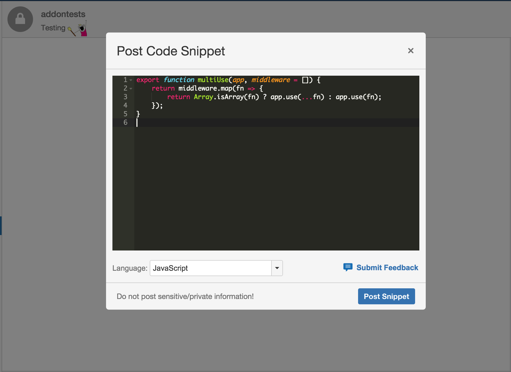
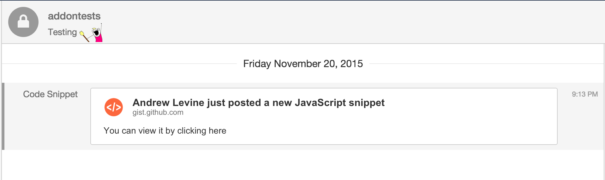
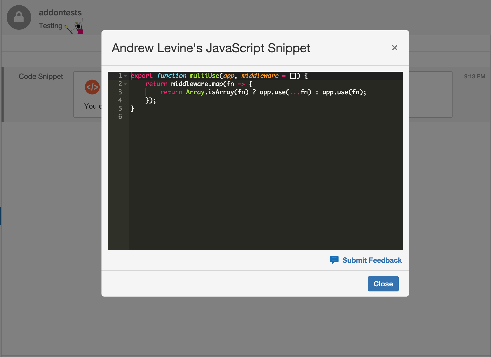

# HipChat Code Snippets

## Technology Stack

- [Express 4](http://expressjs.com/api.html)
- [Redis](http://redis.io/)
- [Babel](https://babeljs.io/)
- [Rollup](http://rollupjs.org/)

## How it Works

When in a chatroom that has the integration installed, users can select the `Post Code Snippet` action. When the user chooses to `Post Snippet`, the following happens:

1. The code is used to create a private GitHub Gist
2. A notification in the chatroom is sent, notifying users of the new snippet
3. Users can click on the notification, which will open a modal with the contents of the private Gist

## Running Locally

**Prerequisites**

- Must be using a version of `node.js` > 5.0.0
- Must have Redis server running locally

### Setup/Configuration

1. Clone the repository
2. Run `npm install` in the root of the repo
3. Setup [ngrok](https://ngrok.com/) (or another local tunnel) to listen on port `3000`
4. Open `config.json`, and change the `localBaseUrl` value to the hostname provided by `ngrok`
5. Run `npm start`, which will build all assets and start the Integration's server

### Installing in HipChat

1. Open up one of your HipChat rooms in the `4.0.x` client, and click `Configure Integrations`
2. Scroll to the bottom of the Integrations page that opened, and click `Install an integration from a descriptor URL`
3. Select the room(s) you wish to install this integration for

## Deploying to a SaaS or PaaS Host

*Coming Soon...*
